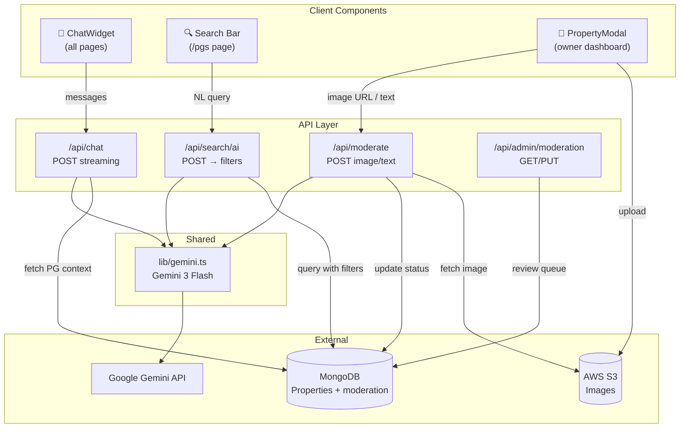

# AI Features Integration for PG Genie — Refined Plan

Integrate three AI-powered features using **Gemini 3 Flash**: a PG-focused chatbot, integrated NL search bar, and NSFW flag-for-review moderation.

---

## Decisions Made

| Question | Decision |
|---|---|
| Model | **Gemini 3 Flash** (~$3/mo) |
| Chatbot scope | **PG Genie-focused only** — deep system prompt with PG knowledge, refuses unrelated questions |
| NSFW strictness | **Flag for manual admin review** — don't block, add `moderationStatus` to Property model |
| NL Search UX | **Integrated search bar** — the existing search bar becomes AI-powered, auto-detects NL queries |

---

## Proposed Changes

### Phase 1: SDK & Shared Library

#### [MODIFY] [package.json](file:///Users/mohd.ashharkhan/Desktop/pggenieRedesign/package.json)
- Install `@google/generative-ai` SDK

#### [MODIFY] [.env.local](file:///Users/mohd.ashharkhan/Desktop/pggenieRedesign/.env.local)
- Add `GEMINI_MODEL=gemini-3-flash`
- Keep existing `GOOGLE_GENERATIVE_AI_API_KEY`

#### [NEW] `src/lib/gemini.ts`
- Initialize `GoogleGenerativeAI` client with the API key
- Export configured model instance with default safety settings
- Export three utility functions:
  - `chatWithPGGenie(messages)` — chatbot with PG system prompt
  - `parseNaturalLanguageSearch(query)` — returns structured filters via function calling
  - `moderateContent(type, content)` — returns safety verdict + categories

---

### Phase 2: AI Chatbot

#### [NEW] `src/app/api/chat/route.ts`
- POST endpoint: `{ messages: [{role: 'user'|'model', content: string}] }`
- **PG Genie System Prompt** (heavily tuned):
  ```
  You are PG Genie Assistant — an AI helper for students searching for 
  Paying Guest accommodations near VIT University in Kothri, Bhopal.
  
  Your expertise:
  - PG listings, pricing, amenities, and room types in Kothri area
  - Booking process and visit scheduling
  - Comparing PGs based on student needs
  - Location guidance (distance from campus, nearby landmarks)
  - General PG living tips for students
  
  Rules:
  - Only answer PG/accommodation-related questions
  - For unrelated questions, politely redirect to PG topics
  - Be concise, friendly, and helpful
  - Use ₹ for prices, suggest specific amenity filters when relevant
  - If asked about specific PGs, mention you can help them search
  ```
- Fetches relevant properties from MongoDB when user asks about listings
- Returns streaming response via `ReadableStream`

#### [NEW] `src/components/ChatWidget.tsx`
- Floating bubble (bottom-right, above `BottomNav` on mobile)
- Click to expand → chat window with:
  - Message history (user + assistant bubbles)
  - Typing indicator with animated dots
  - Quick-action chips: "Find a PG", "Compare prices", "Book a visit"
  - Auto-scroll on new messages
- Persists conversation in `sessionStorage`
- Smooth open/close animation (framer-motion)
- Responsive: full-screen on mobile, floating card on desktop

#### [MODIFY] [layout.tsx](file:///Users/mohd.ashharkhan/Desktop/pggenieRedesign/src/app/layout.tsx)
- Add `<ChatWidget />` to root layout

---

### Phase 3: Integrated NL Search

The existing search bar on `/pgs` becomes AI-aware. When a user types a natural language query (e.g., *"cheap PG near campus with WiFi and AC"*), the system detects it and routes through AI parsing. Simple keyword searches continue to work as before.

#### [NEW] `src/app/api/search/ai/route.ts`
- POST endpoint: `{ query: string }`
- Uses Gemini function calling to extract structured filters:
  ```typescript
  interface ParsedFilters {
    search?: string;       // remaining keyword search
    city?: string;
    minPrice?: number;
    maxPrice?: number;
    amenities?: string[];  // maps to boolean fields + amenities array
    gender?: string;       // "Boys" | "Girls" | "Co-ed"
    sort?: string;         // "price_asc" | "price_desc" | "newest" | "popular"
  }
  ```
- Returns `{ filters: ParsedFilters, interpretation: string }` where `interpretation` is a human-readable summary like *"Showing PGs under ₹8,000 with WiFi and AC"*
- Detection heuristic: if query has 3+ words or contains intent words (near, under, with, cheap, best), route through AI

#### [MODIFY] [pgs/page.tsx](file:///Users/mohd.ashharkhan/Desktop/pggenieRedesign/src/app/pgs/page.tsx)
- Enhance the search bar with AI detection
- On Enter/Search:
  1. If query looks like natural language → call `/api/search/ai`
  2. Apply returned filters to the existing filter state (price range, amenities, gender, sort)
  3. Show AI interpretation text below search bar: *"✨ Showing PGs under ₹8,000 with WiFi..."*
  4. Show extracted filters as editable chips
  5. Fetch properties with the extracted filters using existing `/api/properties` endpoint
- Add subtle sparkle icon (✨) in the search bar to indicate AI capability
- Placeholder text: *"Try: cheap PG near campus with WiFi and meals..."*

---

### Phase 4: NSFW Content Moderation

Flag-for-review system — flagged content is saved but hidden from public listings until admin approves.

#### [NEW] `src/app/api/moderate/route.ts`
- POST endpoint: `{ type: 'image'|'text', content: string }`
- **Image moderation**: 
  - Fetch image from S3 URL → convert to base64
  - Send to Gemini with classification prompt + strict safety settings
  - Read `safetyRatings` from response for categories: `SEXUALLY_EXPLICIT`, `HARASSMENT`, `HATE_SPEECH`, `DANGEROUS_CONTENT`
  - Return: `{ safe: boolean, flagged: boolean, reason?: string, ratings: {...} }`
- **Text moderation**:
  - Send title + description to Gemini with policy check prompt
  - Return: `{ safe: boolean, flagged: boolean, reason?: string }`

#### [MODIFY] [PropertyModal.tsx](file:///Users/mohd.ashharkhan/Desktop/pggenieRedesign/src/components/PropertyModal.tsx)
- After image upload to S3, call `/api/moderate?type=image` with the image URL
- Show status on each uploaded image thumbnail:
  - ✅ Green shield → safe
  - ⏳ Spinner → checking
  - ⚠️ Yellow warning → flagged (with tooltip showing reason)
- On form submit:
  1. Moderate title + description via `/api/moderate?type=text`
  2. If any content is flagged, show warning but **still allow submission**
  3. Set `moderationStatus: 'flagged'` on the property
  4. Show toast: *"Your listing has been submitted for review and will be visible once approved"*
- If all content is safe, set `moderationStatus: 'approved'` and publish immediately

#### [MODIFY] [Property.ts](file:///Users/mohd.ashharkhan/Desktop/pggenieRedesign/src/models/Property.ts)
- Add new field:
  ```typescript
  moderationStatus: 'pending' | 'approved' | 'flagged' | 'rejected';
  moderationDetails?: {
    flaggedImages: number[];    // indices of flagged images
    flaggedText: boolean;       // whether title/description was flagged
    reason?: string;
    reviewedAt?: Date;
    reviewedBy?: string;
  };
  ```
- Default: `moderationStatus: 'approved'` (for backward compatibility with existing listings)

#### [MODIFY] [properties/route.ts](file:///Users/mohd.ashharkhan/Desktop/pggenieRedesign/src/app/api/properties/route.ts)
- **GET**: Add `moderationStatus: { $in: ['approved'] }` to default query filter (only show approved listings publicly)
- **POST**: Run server-side moderation as safety net, set status based on result

---

### Phase 5: Admin Review Queue

#### [MODIFY] Admin Dashboard (if exists at `src/app/admin/`)
- Add a "Content Review" tab/section
- Show list of properties with `moderationStatus: 'flagged'`
- For each flagged property, show:
  - Flagged images highlighted with reason
  - Flagged text highlighted
  - "Approve" / "Reject" action buttons
- On approve → set `moderationStatus: 'approved'`, listing goes public
- On reject → set `moderationStatus: 'rejected'`, notify owner

#### [NEW] `src/app/api/admin/moderation/route.ts`
- GET: Fetch all flagged properties
- PUT: Update moderation status (approve/reject)

---

## Architecture



---

## File Summary

| File | Action | Phase |
|---|---|---|
| `package.json` | MODIFY — add `@google/generative-ai` | 1 |
| `.env.local` | MODIFY — add `GEMINI_MODEL` | 1 |
| `src/lib/gemini.ts` | NEW — Gemini client + helpers | 1 |
| `src/app/api/chat/route.ts` | NEW — chat streaming endpoint | 2 |
| `src/components/ChatWidget.tsx` | NEW — floating chat UI | 2 |
| `src/app/layout.tsx` | MODIFY — add ChatWidget | 2 |
| `src/app/api/search/ai/route.ts` | NEW — NL search parsing | 3 |
| `src/app/pgs/page.tsx` | MODIFY — integrated AI search bar | 3 |
| `src/app/api/moderate/route.ts` | NEW — content moderation | 4 |
| `src/components/PropertyModal.tsx` | MODIFY — add moderation flow | 4 |
| `src/models/Property.ts` | MODIFY — add moderationStatus fields | 4 |
| `src/app/api/properties/route.ts` | MODIFY — filter by moderation status | 4 |
| `src/app/api/admin/moderation/route.ts` | NEW — admin review API | 5 |
| Admin dashboard page | MODIFY — add review queue UI | 5 |

---

## Verification Plan

### Build
```bash
npm run build
```

### Manual Testing
1. **Chatbot**: Open site → click chat bubble → ask "Find me a PG under ₹8000 with WiFi" → verify relevant response
2. **NL Search**: Go to `/pgs` → type "cheap PG with AC and meals for boys" → verify filters auto-applied + interpretation shown
3. **Moderation**: Create a new listing → upload images → verify safety check indicators → submit → verify moderation status in DB
4. **Admin Review**: Check admin dashboard for flagged items → approve → verify listing becomes public
